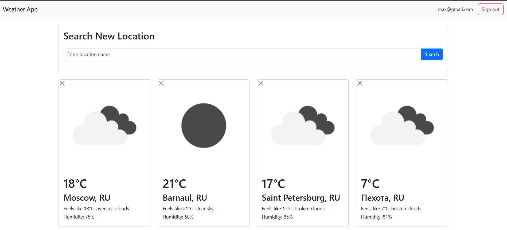
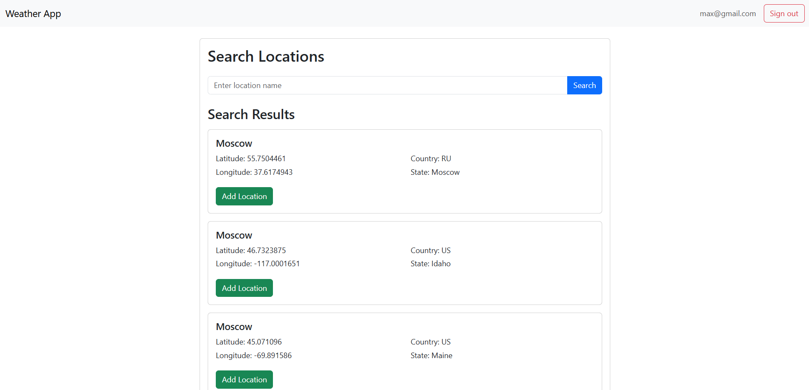

# Weather
A web application for viewing the current weather.

#### Prerequisites: Prerequisites: [Java 21](https://jdk.java.net/21/), [Maven](https://maven.apache.org/), [Hibernate](https://hibernate.org/), [H2](https://www.h2database.com/html/main.html), [JUnit5](https://junit.org/junit5/) and Integration tests, [Liquibase](https://www.liquibase.com/), Thymeleaf, HTML/CSS + Bootstrap for frontend

## Description
The application was implemented as part of [Sergey Zhukov's roadmap](https://zhukovsd.github.io/java-backend-learning-course/projects/weather-viewer/).

Application functionality 
Working with users:
- Registration
- Authorization
- Logout

Working with locations:
- Search
- Adding to the list
- View the list of locations, the name and temperature are displayed for each location.
- Removal from the list

## User Interface
### 1. User locations with weather

### 2. Location search page


## Getting started
### 1. Clone the repository
```shell
git clone https://github.com/floMaxter/Weather
cd Weather
```
or download zip archive
https://github.com/floMaxter/Weather/archive/refs/heads/main.zip

### 2. Start the Database using Docker
```bash
`docker run --name weather_db -e POSTGRES_PASSWORD=password -e POSTGRES_USER=postgres -e POSTGRES_DB=weather_db -p 5433:5432 -d postgres`
```

### 3. Change the environment variable
* The application uses environment variables, an example of these variables is given in the `.env.example`

### 4. Assemble it a war file using Maven
**Note:** The Maven Wrapper is already present in the project, so use the following commands to build

* Linux/macOS:
```bash
./mvnw clean package
```
* Windows
```shell
.\mvnw clean package
```

**Note:** Ready.The war file will be located in the `target/`

### 5. Expand it `.war` in Tomcat
* Copy `target/Weather.war` to the `webapps` of Tomcat
* Run Tomcat
- Linux/maOS
```shell
./bin/startup.sh
```
- Windows
```shell
.\bin\startup.bat
```

### 6. Open app in browser
http://localhost:8080/weather